# Neural Imaging Toolbox 

Authors: [Paweł Korus](http://kt.agh.edu.pl/~korus/) and [Nasir Memon](http://isis.poly.edu/memon/), New York University

A Python toolbox for modeling and optimization of photo acquisition and distribution channels focusing on reliable manipulation detection capabilities. Joint optimization can include the camera ISP (NIP), lossy image compression (DCN), and forensic image analysis (FAN). 

The toolbox provides a [Tensorflow](https://www.tensorflow.org/) implementation of the following generic model: 

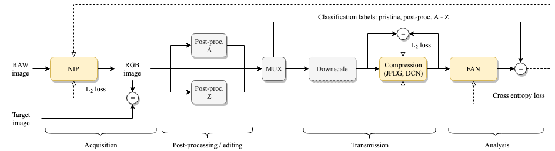

More information can be found in papers listed below:

1. P. Korus, N. Memon, *Content Authentication for Neural Imaging Pipelines: End-to-end Optimization of Photo Provenance in Complex Distribution Channels*, CVPR'19, [arxiv:1812.01516](https://arxiv.org/abs/1812.01516) 
2. P. Korus, N. Memon, *Neural Imaging Pipelines - the Scourge or Hope of Forensics?*, 2019, [arXiv:1902.10707](https://arxiv.org/abs/1902.10707)
3. P. Korus, N. Memon, *Quantifying the Cost of Reliable Photo Authentication via High-Performance Learned Lossy Representations*, ICLR'20, [openreview](https://openreview.net/forum?id=HyxG3p4twS)

A standalone version of the included lossy compression codec can be found in the [neural-image-compression](https://github.com/pkorus/neural-image-compression) repository.

## Change Log

- 2019.12 - Added support for learned compression, configurable manipulations + major refactoring

## Setup

The toolbox was written in Python 3. Follow the standard procedure to install dependencies.

```bash
> git clone https://github.com/pkorus/neural-imaging && cd neural-imaging.git
> pip3 install -r requirements.txt
> mkdir -p data/{raw,rgb}
> git submodule init
> cd pyfse && make && cd ..
```

#### Data Directory Structure

The toolbox uses the `data` directory to store images, training data and pre-trained models:

```
data/raw/                               - RAW images used for camera ISP training
  |- images/{camera name}                 RAW images (*.nef *.dng)
  |- nip_training_data/{camera name}      Bayer stacks (*.npy) and developed (*.png)
  |- nip_developed/{camera name}/{nip}    NIP-developed images (*.png)
data/rgb/                               - RGB images used for compression training
  |- kodak                                A sample dataset with kodak images
data/config                             - Training configuration files (e.g., DCN)
data/models                             - pre-trained TF models
  |- nip/{camera name}/{nip}              NIP models (TF checkpoints)
  |- dcn/{dcn model}                      DCN models (TF checkpoints)
data/m                                  - manipulation training results
data/results                            - CSV files with exported results
```

## Getting Started

The model can be easily customized to use various NIP models, photo manipulations, distribution channels, etc. Detailed configuration instruction are given below in sub-section (III). We generally follow a 2-step protocol with separate model pre-training (camera ISP and/or compression) and joint-optimization/fine-tuning for manipulation detection (retraining from scratch is also possible). 

The following sections cover all steps:

- pre-training of the NIP models for faithful photo development,
- pre-training of the DCN for efficient lossy photo compression,
- joint fine-tuning of the NIP/DCN/FAN models for reliable image manipulation detection.

### (I) Pre-training the NIP (Camera ISP)

The camera ISP is replaced with a convolutional neural network (NIP) which replaces the following steps from the standard pipeline:

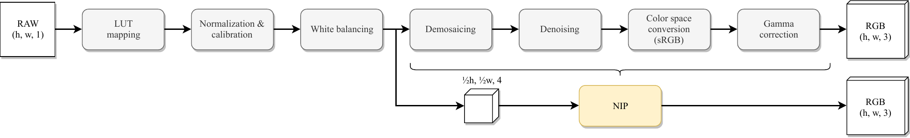

To pre-train a NIP model, we must first extract training data for a given camera. The training script looks for RAW images in `./data/raw/images/{camera name}`. By default, 150 horizontal images will be taken. This step produces pairs of RGGB Bayer stacks (stored in `*.npy` files) and RGB optimization targets (`*.png`).

```bash
> python3 train_prepare_training_set.py --cam EOS-4D
```

Then, we train selected NIP models (the `--nip` argument can be repeated). This step consumes (RGGB, RGB) training pairs and trains the NIP by optimizing the L2 loss on randomly sampled patches. By default, the 150 available images are split into 120/30 for training/validation.

```bash
> python3 train_nip.py --cam EOS-4D --nip INet --nip UNet
```

If needed, additional parameters for the NIPs can be provided as a JSON string.

```bash
> python3 train_nip.py --cam D7000 --nip INet --params '{"random_init": true}'
```

To validate the NIP models, you may wish to develop some images. The following command will develop all images in the data set. In this command, you can use all of the available imaging pipelines: `libRAW, Python, INet, DNet, UNet`.

```bash
> python3 develop_images.py {camera} {pipeline}
```

An example photograph developed with all of the available pipelines is shown below.  

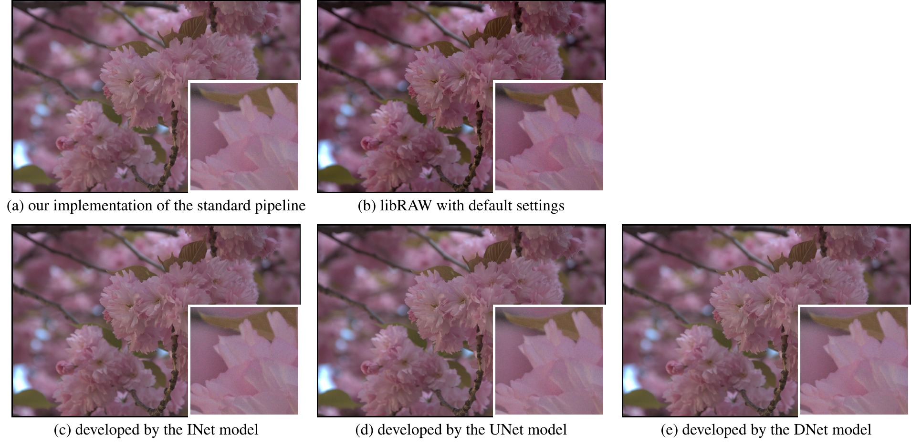

To quickly test a selected NIP on a central image patch (128 x 128 px by default):

```bash
> python3 test_nip.py --cam "Canon EOS 5D" --nip INet
```

### (II) Pre-training Lossy Compression

Our toolbox can support various DCN models, but by default we provide only one - `TwitterDCN`. This model follows the general autoencoder architecture by [Theis et al.](https://arxiv.org/abs/1703.00395) but uses custom solutions for quatization, entropy estimation and coding. We illustrate the structure of the model below.

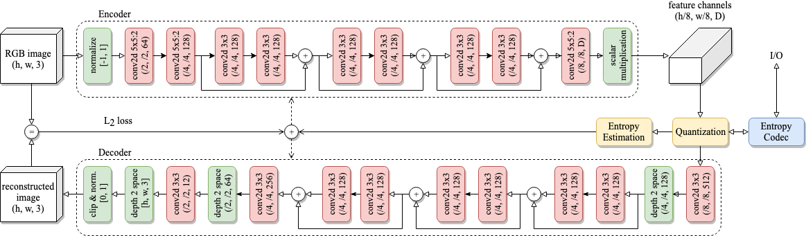

We also provide 3 pre-trained versions of this model with low, medium and high-quality. The rate-distortion trade-off on 3 different datasets is shown below. 

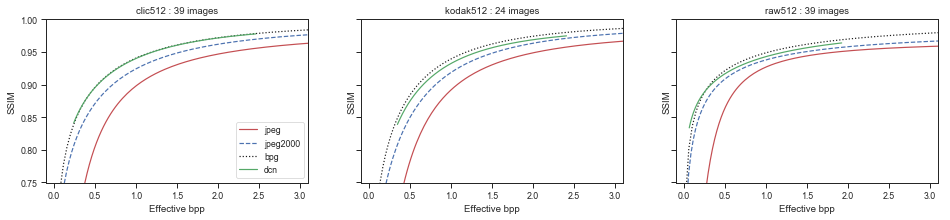

To train a different model, we can use the `train_dcn` script and provide a list of model configurations (csv file with hyper-parameter values) and an RGB training set, e.g.:

```bash
> python3 train_dcn.py --dcn TwitterDCN --split 31000:1000:1 --param_list data/config/twitter.csv --epochs 2500 --out data/models/dcn/custom --data data/rgb/compression/
```

We test the DCN using the `test_dcn` script which can:

- show compression results for a batch of images
- compare against JPEG compression at a matching quality level / bpp
- generate rate-distortion curves for various codecs

For example, to compare our low-quality codec against JPEG at matching bpp:

```bash
> python3 test_dcn.py --data ./data/rgb/kodak --dcn 16c jpeg-match-bpp --image 4
```

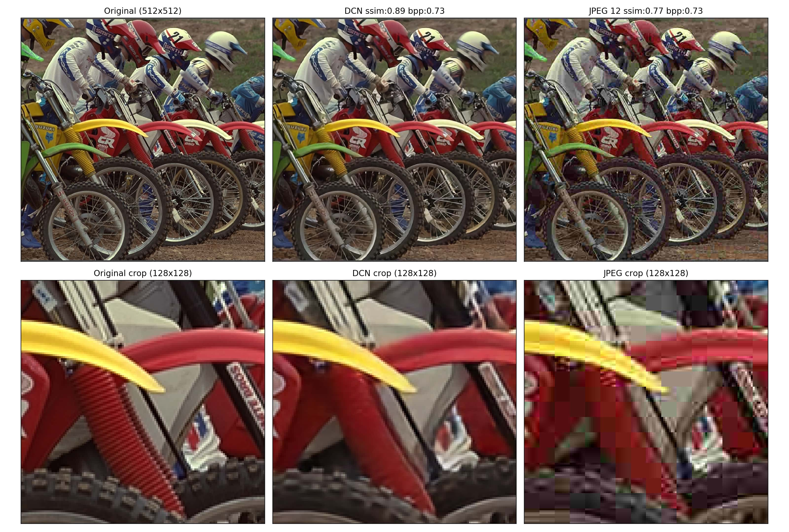

### (III) Optimization for Manipulation Detection

The main script for training the entire workflow is `train_manipulation.py`. The script accepts command line parameters to control the model. An example command is shown and explained below:

```bash
> python3 train_manipulation.py \
--epochs=2501                `# Run optimization for 2,500 epochs` \
--end 3                      `# Repeat the experiment 3 times` \
--patch 128                  `# The output from NIP should be 128x128 RGB image` \
--ds none                    `# Skip down-sampling in the channel` \
--jpeg 50                    `# Use JPEG with QF 50 as channel compression` \
--nip DNet                   `# Use DNet model for camera ISP` \
--cam D90                    `# Use Nikon D90 images` \
--manip sharpen:1,gaussian,jpeg:80,awgn:4,median `# List of included manipulations` \
--dir ./data/m/jpeg-nip+/50  `# Output directory` \
--train nip                  `# Models for optimization, here only NIP` \
--ln 0.1 --ln 0.05 --ln 0.01 `# Repeat training for these regularization strenghts`
```

The list of included manipulations is comma-separated and can include optional strength (after a colon). The results will be generated into:

```
data/m/jpeg-nip+/50/{camera}/{nip}/ln-{NIP-regularization}/{run number}/
```

The script generates:
- `training.json` - JSON file with training progress and performance stats,
- `manip_validation_*.jpg` - visual presentation of training progress (change of loss, PSNR, etc. over time)
- `nip_validation_*.jpg` - current snapshot of patches developed by the NIP
- `models/{fan,...}` - current snapshot of the models (FAN and other optimized models)

**Plotting Results**

The results can be quickly inspected / exported with the `results.py` script. Supported output modes are shown in table below. Data can be exported by appending `--df {output dir}` .

| Output mode                     | Description                                                  |
| ------------------------------- | ------------------------------------------------------------ |
| `scatter-psnr` / `scatter-ssim` | show accuracy / image quality trade-off (NIP optimization)   |
| `progress`                      | show training progress                                       |
| `conf` / `conf-tex`             | print confusion matrices as plain text or LaTeX tables       |
| `ssim` / `psnr`/`accuracy`      | boxplots with image quality / accuracy                       |
| `df`                            | print results' summary as a table                            |
| `auto`                          | automatically parse the results' structure and plot accuracy for various configurations |

For example, the following command shows the scatter plot with the trade-off between classification accuracy and image fidelity for the `UNet` model trained on `Nikon D90` :

```bash
> python3 results.py --nip UNet --cam D90 scatter-psnr
```

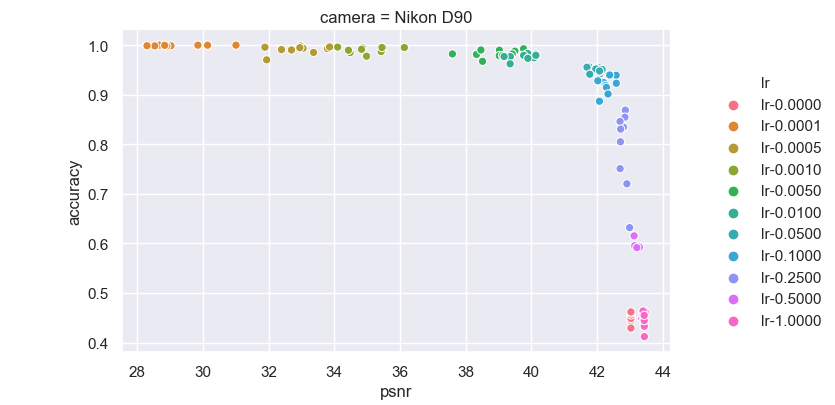

To visualize variations of classification accuracy and image quality as the training progresses:

```bash
> python3 results.py --nip UNet --cam D90 progress
```
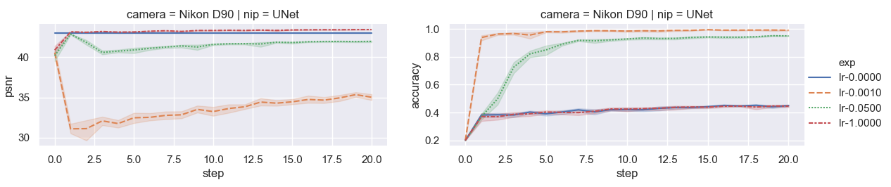

To show confusion matrices for all regularization strengths:

```bash
> python3 results.py --nip UNet --cam D90 confusion
```
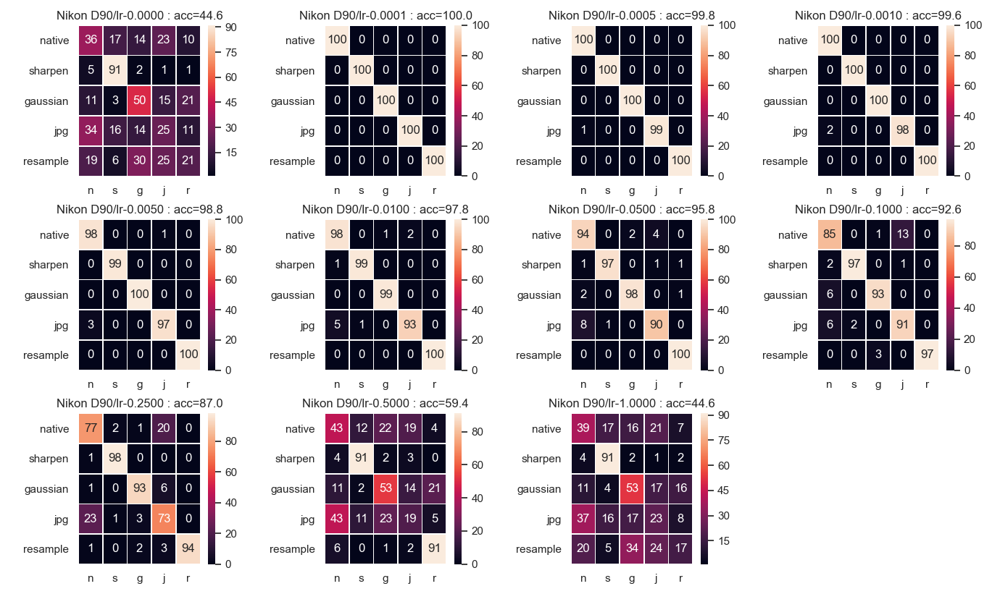

**Show Differences in NIP models**

This command shows differences between a UNet model trained normally (A) and with manipulation detection objectives (B). 

```bash
> python3 diff_nip.py --nip UNet --cam D90 --b ./data/m/D90/UNet/ln-0.1000/000/models/ --image 16
```

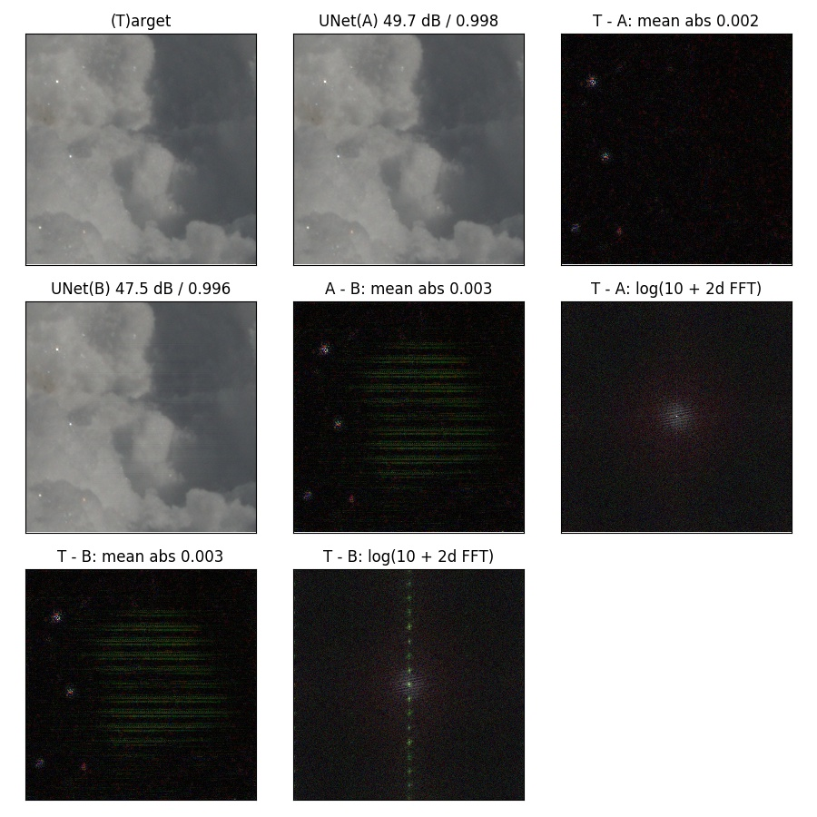

## Available Pipelines

The toolbox currently provides the following pipelines:

| Pipeline | Description                                                  |
| -------- | ------------------------------------------------------------ |
| `libRAW` | uses the libRAW library to develop RAW images                |
| `Python` | simple Python implementation of a standard pipeline          |
| `INet`   | simple NIP which mimics step-by-step processing of the standard pipeline |
| `UNet`   | the well known UNet network                                  |
| `DNet`   | medium-sized model adapted from a recent architecture for joint demosaicing and denoising |
| `ONet`   | dummy pipeline for directly feeding RGB images into the workflow |

The standard pipelines are available in the `raw_api` module. Neural pipelines are available in `models/pipelines`. The `UNet` model was adapted from [Learning to See in the Dark](https://github.com/cchen156/Learning-to-See-in-the-Dark).

## Implementing New Pipelines

The toolbox pools available neural pipelines from the `models/pipelines` module. Implementation of new pipelines involves sub-classing `NIPModel` and providing implementations for the `construct_model` method and the `parameters` property. 

Network models are expected to use the provided input placeholder (`self.x`) and add attributes for model output (`self.y` and optionally `self.yy`). The standard output (`self.y`) should be clipped to [0,1]. For better learning stability, a non-clipped output can be provided (`self.yy`) - it will be automatically used for gradient computation. The models should use an optional string prefix (`self.label`) in variable names or named scopes. This facilitates the use of multiple NIPs in a single TF graph. 

## JPEG Approximation

The repository contains a differentiable model of JPEG compression which can be useful in other research as well (see `models.jpeg.DJPG`). The model expresses successive steps of the codec as  matrix multiplications or convolution layers (see papers for details) and supports the following approximations of DCT coefficient quantization:

- `None` - uses standard rounding (backpropagation not supported)
- `sin` - sinusoidal approximation of the rounding operator (allows for back-propagation)
- `soft` - uses standard rounding in the forward pass and sinusoidal approximation in the backward pass
- `harmonic` - a differentiable approximation with Taylor expansion 

See the test script `test_jpg.py` for a standalone usage example. The following plot compares image quality and generated outputs for various approximation modes.

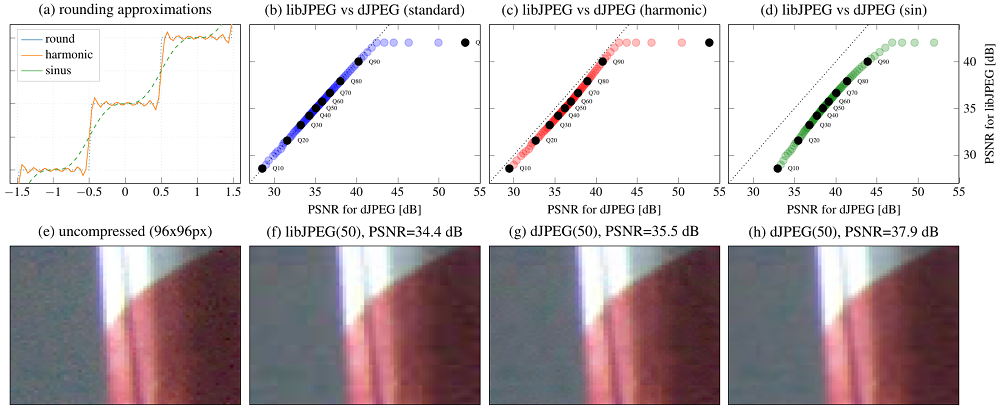

## Implementing New Image Codecs

Lossy compression codecs are located in `models.compression` and should inherit from the `DCN` class which provides a general framework with quantization, entropy regularization, etc. already set up. Specific children classes should reimplement the `construct_model` method and use helper functions to set up quantization, e.g.:

```python
def construct_model(self, params):
  # Define hyper-parameters
  self._h = paramspec.ParamSpec({
    'n_features': (96, int, (4, 128)),
  })
  self._h.update(**params)
	# Encoder setup...
  latent = tf.contrib.layers.conv2d(self.x, ...)
  self.latent = self._setup_latent_space(latent)
  # Decoder setup...
  y = tf.contrib.layers.conv2d(self.latent, ...)
  y = tf.depth_to_space(y, ...)
  self.y = y
```

Use the `TwitterDCN` class as a reference.

## Forensics Analysis Network

Our Forensic Analysis Network (FAN) follows the state-of-the-art design principles and uses a constrained convolutional layer proposed in:

- Bayar, Belhassen, and Matthew C. Stamm. [Constrained convolutional neural networks: A new approach towards general purpose image manipulation detection.](https://ieeexplore.ieee.org/document/8335799) IEEE Transactions on Information Forensics and Security, 2018

While the original model used only the green channel, our FAN uses full RGB information for forensic analysis. See the `models.forensics.FAN` class for our Tensorflow implementation.

## Other Useful Scripts

| Script             | Description                                                  |
| ------------------ | ------------------------------------------------------------ |
| `summarize_nip.py` | extracts and summarizes performance stats for standalone NIP models |
| `test_fan.py`      | allows for testing trained FAN models on various datasets    |

## Data Sources

In our experiments we used RAW images from publicly available datasets: 

- MIT-5k - [https://data.csail.mit.edu/graphics/fivek/](https://data.csail.mit.edu/graphics/fivek/)
- RAISE - [http://loki.disi.unitn.it/RAISE/](http://loki.disi.unitn.it/RAISE/)

## Usage and Citations

This code is provided for educational purposes and aims to facilitate reproduction of our results, and further research in this direction. We have done our best to document, refactor, and test the code before publication. However, the toolbox is provided "as-is", without warranties of any kind.   

If you find any bugs or would like to contribute new models, training protocols, etc, please let us know. 

If you find this code useful in your work, please cite our papers:

```
@inproceedings{korus2019content,
  title={Content Authentication for Neural Imaging Pipelines: End-to-end Optimization of Photo Provenance in Complex Distribution Channels},
  author={Korus, Pawel and Memon, Nasir},
  booktitle={IEEE Conf. Computer Vision and Pattern Recognition},
  year={2019}
}
```
```
@article{korus2019neural,
  title={Neural Imaging Pipelines - the Scourge or Hope of Forensics?},
  author={Korus, Pawel and Memon, Nasir},
  journal={arXiv preprint arXiv:1902.10707},
  year={2019}
}
```
```
@inproceedings{korus2020quantifying,
  title={Quantifying the Cost of Reliable Photo Authentication via High-Performance Learned Lossy Representations},
  author={Korus, Pawel and Memon, Nasir},
  booktitle={IEEE Conf. Learning Representations},
  year={2020}
}
```

## Related Work

### End-to-end ISP optimization:

- Eli Schwartz, Raja Giryes, Alex M. Bronstein, [DeepISP: Towards Learning an End-to-End Image Processing Pipeline](https://arxiv.org/abs/1801.06724), 2019 - optimization for low-light performance
- Chen Chen, Qifeng Chen, Jia Xu, Vladlen Koltun, [Learning to See in the Dark](https://arxiv.org/abs/1805.01934), 2018 - optimization for low-light performance
- Marc Levoy, Yael Pritch [Night Sight: Seeing in the Dark on Pixel Phones](https://ai.googleblog.com/2018/11/night-sight-seeing-in-dark-on-pixel.html), 2018 - low-light optimization in Pixel 3 phones
- Steven Diamond, Vincent Sitzmann, Stephen Boyd, Gordon Wetzstein, Felix Heide, [Dirty Pixels: Optimizing Image Classification Architectures for Raw Sensor Data](https://arxiv.org/abs/1701.06487), 2017 - optimization for high-level vision
- Haomiao Jiang, Qiyuan Tian, Joyce Farrell, Brian Wandell, [Learning the Image Processing Pipeline](https://ieeexplore.ieee.org/document/7944641), 2017 - learning ISPs for non-standard CFA patterns
- Gabriel Eilertsen, Joel Kronander, Gyorgy Denes, Rafał K. Mantiuk, Jonas Unger, [HDR image reconstruction from a single exposure using deep CNNs](http://hdrv.org/hdrcnn/), 2017 - HDR simulation from a single exposure
- Felix Heide et al., [FlexISP: A Flexible Camera Image Processing Framework](http://www.cs.ubc.ca/labs/imager/tr/2014/FlexISP/), 2014 - general ISP optimization framework for various low-level vision problems

### Learned Compression

- Eirikur Agustsson, Michael Tschannen, Fabian Mentzer, Radu Timofte & Luc Van Gool, [Generative Adversarial Networks For Extreme Learned Image Compression](http://arxiv.org/abs/1804.02958), 2018 - using GANs to synthesize appearance on inconsequential content 
- Fabian Mentzer, Eirikur Agustsson, Michael Tschannen, Radu Timofte & Luc Van Gool, [Conditional Probability Models for Deep Image Compression](http://arxiv.org/abs/1801.04260), 2018 - adopts PixelCNN for context modeling
- Johannes Ballé, David Minnen, Saurabh Singh, Sung Jin Hwang, Nick Johnston, [Variational Image Compression With A Scale Hyperprior](http://arxiv.org/abs/1802.01436), 2018 - an additional hyper-prior to handle spatial dependencies
- Lucas Theis, Wenzhe Shi, Andrew Cunningham & Ferenc Huszar, [Lossy Image Compression with Compressive Autoencoders](http://arxiv.org/abs/1703.00395), 2017 - deep auto-encoder competitive with JPEG2000
- Oren Rippel & Lubomir Bourdev, [Real-Time Adaptive Image Compression](http://arxiv.org/abs/1705.05823), 2017 - a high-performance lossy codec
- Johannes Ballé, Valero Laparra & Eero P. Simoncelli, [End-to-end Optimized Image Compression](http://arxiv.org/abs/1611.01704), 2016 - end-to-end optimization framework