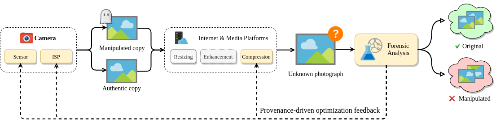

# Neural Imaging Toolbox 

Authors: [Paweł Korus](http://kt.agh.edu.pl/~korus/) and [Nasir Memon](http://isis.poly.edu/memon/), New York University

A Python+Tensorflow toolbox for modeling and optimization of photo acquisition, distribution, and forensic analysis. It enables joint optimization of various components, e.g.: 
- fine-tuning of camera ISP to actively introduce traces useful for manipulation detection,
- fine-tuning of lossy compression to leave more relevant statistical traces in the photographs. 



The toolbox provides several general-purpose components (camera ISP, differentiable JPEG, learned lossy compression, state-of-the-art image forensics) that can be combined into various workflows. 

> :information_source: A standalone version of our lossy compression codec can be found in the [l3ic](https://github.com/pkorus/l3ic) repository.

> :warning: The current implementation uses [Tensorflow 2.x](https://www.tensorflow.org/). Legacy versions using Tensorflow 1.x can be accessed via git history.

## References

1. P. Korus, N. Memon, *Content Authentication for Neural Imaging Pipelines: End-to-end Optimization of Photo Provenance in Complex Distribution Channels*, CVPR'19, [arxiv:1812.01516](https://arxiv.org/abs/1812.01516) 
2. P. Korus, N. Memon, *Neural Imaging Pipelines - the Scourge or Hope of Forensics?*, 2019, [arXiv:1902.10707](https://arxiv.org/abs/1902.10707)
3. P. Korus, N. Memon, *Quantifying the Cost of Reliable Photo Authentication via High-Performance Learned Lossy Representations*, ICLR'20, [openreview](https://openreview.net/forum?id=HyxG3p4twS)

## Pre-trained Models  

- Pre-trained models (TF checkpoints) and sample datasets can be downloaded at 
[pkorus.pl/downloads/neural-imaging-resources](https://pkorus.pl/downloads/neural-imaging-resources). 
- A standalone version of our lossy compression codec can be found in the [l3ic](https://github.com/pkorus/l3ic) repository.

## Change Log

- 2020.04 - Ported to Tensorflow 2.x + added workflows, classic ISPs, JPEG improvements
- 2019.12 - Added support for learned compression, configurable manipulations + major refactoring

## Setup

The toolbox was written in Python 3. Follow the standard procedure to install dependencies. Some modules need to be complied for your platform.   

```bash
> git clone https://github.com/pkorus/neural-imaging && cd neural-imaging
> pip3 install -r requirements.txt
> mkdir -p data/{raw,rgb}
> git submodule init
> cd pyfse && make && cd ..
```

**Sample datasets** and **pre-trained models** can be downloaded at 
[pkorus.pl/downloads/neural-imaging-resources](https://pkorus.pl/downloads/neural-imaging-resources).

#### Data Directory Structure

The toolbox uses the `data` directory to store images, training data and pre-trained models:

```
config/                                 - various configuration files
data/raw/                               - RAW images used for camera ISP training
  |- images/{camera name}                 input RAW images (*.nef *.dng)
  |- training_data/{camera name}          Bayer stacks (*.npy) and developed (*.png)
  |- developed/{camera name}/{nip}        output RGB images (*.png)
data/rgb/                               - RGB images used for compression training
  |- kodak                                A sample dataset with kodak images
data/models                             - pre-trained TF models
  |- nip/{camera name}/{nip}              NIP models (TF checkpoints)
  |- isp                                  Classic ISP models (TF checkpoints)
  |- dcn/baselines/{dcn model}            DCN models (TF checkpoints)
data/m                                  - manipulation training results
data/results                            - CSV files with exported results
```

## Getting Started

A great place to get started quickly is the [getting_started.ipynb](getting_started.ipynb) notebook. 

## Available Models

- several ISP models including [neural](docs/pretrain_nip.md) and classic ISPs (see below),
- a [differentiable JPEG codec](docs/manipulation_classification.md),
- a high-performance [neural image compression codec](docs/pretrain_dcn.md),
- state-of-the-art image forensics model.

**Camera ISP Models**

| Pipeline       | Description                                                  |
| -------------- | ------------------------------------------------------------ |
| `ClassicISP`   | a standard ISP model with neural demosaicing                 |
| `INet`         | simple NIP which mimics step-by-step processing of the standard pipeline |
| `UNet`         | the well known UNet network                                  |
| `DNet`         | medium-sized model adapted from a recent architecture for joint demosaicing and denoising |
| `ONet`         | dummy model for directly feeding RGB images into the pipeline |
| `libRAW`       | uses the libRAW library to develop RAW images                |
| `Python`       | simple Python implementation of a standard pipeline          |

Fully differentiable pipelines (`ClassicISP` and `*Net`) are implemented in `models/pipelines`. The last two standard pipelines are not differentiable and are not integrated with other models - they are available in the `helpers.raw` module.

**JPEG Codec**

We provide a fully differentiable implementation of the JPEG codec and a high-level interface that allows for switching between the differentiable codec and libJPEG. For more information see section [JPEG Codecs](docs/jpeg.md) and docstrings in `models.jpeg.JPEG`. 
  
**Learned Codec**

Our neural image compression codec is an adaptation of the auto-encoder architecture proposed by Twitter (Theis et al., [Lossy Image Compression with Compressive Autoencoders](http://arxiv.org/abs/1703.00395)), and hence is dubbed `TwitterDCN` (see `models/compression.py`). A standalone version is also available in the [neural-image-compression](https://github.com/pkorus/neural-image-compression) repository.

**Image Forensics**

Our Forensic Analysis Network (FAN) follows the state-of-the-art design principles and uses a constrained convolutional layer proposed in:

- Bayar, Belhassen, and Matthew C. Stamm. [Constrained convolutional neural networks: A new approach towards general purpose image manipulation detection.](https://ieeexplore.ieee.org/document/8335799) IEEE Transactions on Information Forensics and Security, 2018

While the original model used only the green channel, our FAN uses full RGB information for forensic analysis. See the `models.forensics.FAN` class for our Tensorflow implementation.

## Pre-training

We generally follow a 2-step protocol with separate model pre-training (camera ISP, compression) and joint optimization/fine-tuning for specific applications (retraining from scratch is also possible, but has not been tested extensively). 

- [pre-training of camera ISP](docs/pretrain_nip.md),
- [pre-training of neural image compression](docs/pretrain_dcn.md).

## Workflows

Individual components can be combined into **workflows** that model specific applications and allow for joint optimization of the entire pipeline. The current version of the toolbox provides an example workflow for *manipulation classification* - a standard benchmark for image forensics.

### Manipulation Classification

The [manipulation classification workflow]((docs/manipulation_classification.md)) involves training a forensic analysis network (FAN) to identify subtle post-processing operations applied to the image. The model starts with the camera ISP and is followed by photo manipulations and a distribution channel. The FAN can access images after they have been degraded (e.g., down-sampled and compressed) by the channel. The model is shown below:   


## Extending the Framework

The framework can be easily extended. See the [extensions](docs/extensions.md) section for information how to get started. If you would like to contribute new models, training protocols, or if you find any bugs, please let us know. 

## Script Summary

| Script                          | Description                                                  |
| ------------------------------- | ------------------------------------------------------------ |
| `develop_images.py`             | batch rendering of RAW images using various camera ISPs      |
| `diff_nip.py`                   | compare RAW rendering results of two camera ISPs             |
| `results.py`                    | visualization of FAN [optimization results](docs/results.md) |
| `test_dcn.py`                   | test neural image compression / generate rate-distortion profiles |
| `test_dcn_rate_dist.py`         | plot rate-distortion (R/D) curves for neural image compression (requires pre-computing R/D profiles using `test_dcn.py`) |
| `test_fan.py`                   | allows for testing trained FAN models on various datasets    |
| `test_framework.py`             | a rudimentary test of the entire framework (see [testing](docs/testing.md)) |
| `test_jpeg.py`                  | test differentiable approximation of the JPEG codec          |
| `test_nip.py`                   | test a pre-trained camera ISP                                |
| `train_dcn.py`                  | [pre-train lossy compression](docs/pretrain_dcn.md)          |
| `train_manipulation.py`         | optimization of the FAN (+NIP/DCN) for manipulation detection |
| `train_nip.py`                  | [pre-train camera ISPs](docs/pretrain_nip.md)                |
| `train_prepare_training_set.py` | prepare training data for camera ISP pre-training (imports RAW images) |
| `summarize_nip.py`              | extracts and summarizes performance stats for standalone NIP models |

## Data Sources

In our experiments we used RAW images from publicly available datasets: 

- MIT-5k - [https://data.csail.mit.edu/graphics/fivek/](https://data.csail.mit.edu/graphics/fivek/)
- RAISE - [http://loki.disi.unitn.it/RAISE/](http://loki.disi.unitn.it/RAISE/)

## Usage and Citations

This code is provided for educational purposes and aims to facilitate reproduction of our results, and further research in this direction. We have done our best to document, refactor, and test the code before publication. However, the toolbox is provided "as-is", without warranties of any kind.   

If you find this code useful in your work, please cite our papers:

```
@inproceedings{korus2019content,
  title={Content Authentication for Neural Imaging Pipelines: End-to-end Optimization of Photo Provenance in Complex Distribution Channels},
  author={Korus, Pawel and Memon, Nasir},
  booktitle={IEEE Conf. Computer Vision and Pattern Recognition},
  year={2019}
}
```
```
@article{korus2019neural,
  title={Neural Imaging Pipelines - the Scourge or Hope of Forensics?},
  author={Korus, Pawel and Memon, Nasir},
  journal={arXiv preprint arXiv:1902.10707},
  year={2019}
}
```
```
@inproceedings{korus2020quantifying,
  title={Quantifying the Cost of Reliable Photo Authentication via High-Performance Learned Lossy Representations},
  author={Korus, Pawel and Memon, Nasir},
  booktitle={IEEE Conf. Learning Representations},
  year={2020}
}
```

## Related Work

### End-to-end ISP optimization:

- Andrey Ignatov, Luc Van Gool, Radu Timofte. [Replacing Mobile Camera ISP with a Single Deep Learning Model](https://arxiv.org/abs/2002.05509), 2020, replacement of the entire ISP
- Eli Schwartz, Raja Giryes, Alex M. Bronstein, [DeepISP: Towards Learning an End-to-End Image Processing Pipeline](https://arxiv.org/abs/1801.06724), 2019 - optimization for low-light performance
- Chen Chen, Qifeng Chen, Jia Xu, Vladlen Koltun, [Learning to See in the Dark](https://arxiv.org/abs/1805.01934), 2018 - optimization for low-light performance
- Marc Levoy, Yael Pritch [Night Sight: Seeing in the Dark on Pixel Phones](https://ai.googleblog.com/2018/11/night-sight-seeing-in-dark-on-pixel.html), 2018 - low-light optimization in Pixel 3 phones
- Steven Diamond, Vincent Sitzmann, Stephen Boyd, Gordon Wetzstein, Felix Heide, [Dirty Pixels: Optimizing Image Classification Architectures for Raw Sensor Data](https://arxiv.org/abs/1701.06487), 2017 - optimization for high-level vision
- Haomiao Jiang, Qiyuan Tian, Joyce Farrell, Brian Wandell, [Learning the Image Processing Pipeline](https://ieeexplore.ieee.org/document/7944641), 2017 - learning ISPs for non-standard CFA patterns
- Gabriel Eilertsen, Joel Kronander, Gyorgy Denes, Rafał K. Mantiuk, Jonas Unger, [HDR image reconstruction from a single exposure using deep CNNs](http://hdrv.org/hdrcnn/), 2017 - HDR simulation from a single exposure
- Felix Heide et al., [FlexISP: A Flexible Camera Image Processing Framework](http://www.cs.ubc.ca/labs/imager/tr/2014/FlexISP/), 2014 - general ISP optimization framework for various low-level vision problems

### Learned Compression

- Eirikur Agustsson, Michael Tschannen, Fabian Mentzer, Radu Timofte & Luc Van Gool, [Generative Adversarial Networks For Extreme Learned Image Compression](http://arxiv.org/abs/1804.02958), 2018 - using GANs to synthesize appearance on inconsequential content 
- Fabian Mentzer, Eirikur Agustsson, Michael Tschannen, Radu Timofte & Luc Van Gool, [Conditional Probability Models for Deep Image Compression](http://arxiv.org/abs/1801.04260), 2018 - adopts PixelCNN for context modeling
- Johannes Ballé, David Minnen, Saurabh Singh, Sung Jin Hwang, Nick Johnston, [Variational Image Compression With A Scale Hyperprior](http://arxiv.org/abs/1802.01436), 2018 - an additional hyper-prior to handle spatial dependencies
- Lucas Theis, Wenzhe Shi, Andrew Cunningham & Ferenc Huszar, [Lossy Image Compression with Compressive Autoencoders](http://arxiv.org/abs/1703.00395), 2017 - deep auto-encoder competitive with JPEG2000
- Oren Rippel & Lubomir Bourdev, [Real-Time Adaptive Image Compression](http://arxiv.org/abs/1705.05823), 2017 - a high-performance lossy codec
- Johannes Ballé, Valero Laparra & Eero P. Simoncelli, [End-to-end Optimized Image Compression](http://arxiv.org/abs/1611.01704), 2016 - end-to-end optimization framework

## Acknowledgements

This work was supported by the NSF award number 1909488.
