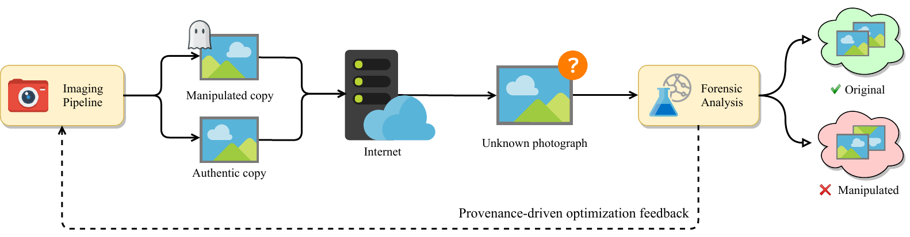

# Neural Imaging Toolbox 

Authors: [Paweł Korus](http://kt.agh.edu.pl/~korus/) and [Nasir Memon](http://isis.poly.edu/memon/), New York University

A Python toolbox for training neural imaging pipelines (NIPs) with support for explicit optimization of content authentication capabilities at the end of content distribution channels. The general principle is illustrated below for a binary manipulation detection problem:



The whole imaging and distribution channel is modeled as a fully differentiable [Tensorflow](https://www.tensorflow.org/) model. The camera is replaced with a convolutional neural network and optimized for:

- faithful development of color RGB images from RAW sensor measurements,
- reliable manipulation detection at the end of the distribution channel.

The NIP is used to replace most of the steps of the standard pipeline:     


More information can be found in papers listed below.

**References:**

1. P. Korus, N. Memon, *Content Authentication for Neural Imaging Pipelines: End-to-end Optimization of Photo Provenance in Complex Distribution Channels*, CVPR'19, [arxiv:1812.01516](https://arxiv.org/abs/1812.01516) 
2. P. Korus, N. Memon, *Neural Imaging Pipelines - the Scourge or Hope of Forensics?*, 2019

## Setup

The toolbox was written in Python 3. Follow the standard procedure to install dependencies.

```
> git clone https://github.com/pkorus/neural-imaging && cd neural-imaging.git
> pip3 install -r requirements.txt
> mkdir -p data/raw
```

#### Data Directory Structure

The `data/raw` directory is used for storing all data (input images, training pairs, trained model snapshots, etc.). The expected content looks as follow:

```
images/{Camera name}                         - RAW images (*.nef *.dng)
nip_training_data/{Camera name}              - Bayer stacks (uint16 *.npy) and developed (*.png)
nip_model_snapshots/{Camera name}/{Model}    - NIP models (TF checkpoints)
nip_developed/{Camera name}/{Pipeline/Model} - NIP-developed images (*.png)
```

Training data can be prepared from input images with the `train_prepare_training_set.py` script (see details below).

## Getting Started

We followed a two-phase protocol to train our models:
- pre-training of the NIP models for faithful photo development,
- fine-tuning of the NIP models to optimize for reliable image manipulation detection.

Since the second phase uses both image fidelity and classification accuracy objectives, the enhanced NIP model can most likely be trained using the second phase only, but this has not been tested. 

### Phase I: Standard NIP Training

First, we need to extract NIP training data for a given camera. The training script looks for RAW images in `./data/raw/images/{camera}`. By default, 150 horizontal images will be taken. This step produces pairs of RGGB Bayer stacks (stored in `*.npy` files) and RGB optimization targets (`*.png`).

```
> python3 train_prepare_training_set.py --cam "Canon EOS 4D"
```

Then, we train selected NIP models (the `--nip` argument can be repeated). This step consumes (RGGB, RGB) training pairs and trains the NIP by optimizing the L2 loss on randomly sampled patches. By default, the 150 available images are split into 120/30 for training/validation.

```
> python3 train_nip.py --cam "Canon EOS 4D" --nip INet --nip UNet
```

If needed, additional parameters for the NIPs can be provided as a JSON string.

```
> python3 train_nip.py --cam "Nikon D7000" --nip INet --params '{"random_init": true}'
```

To validate the NIP models, you may wish to develop some images. The following command will develop all images in the data set. In this command, you can use all of the available imaging pipelines: `libRAW, Python, INet, DNet, UNet`.

```
> python3 develop_images.py {camera} {pipeline}
```

An example photograph developed with all of the available pipelines is shown below.  


To quickly test a selected NIP on a central image patch (128 x 128 px by default):

```
> python3 test_nip.py --cam "Canon EOS 5D" --nip INet
``` 

### Phase II: Training NIPs Optimized for Manipulation Detection


The following command can be used for training NIPs optimized for image manipulation detection. In the current experiment, we follow a common evaluation protocol and train to distinguish between native camera output and 4 manipulation classes: sharpening, re-sampling, Gaussian filtering, and JPEG compression. (See figure above and our paper for details.) The basic usage is as follows:

```
> python3 train_manipulation.py --nip UNet --cam "Nikon D90" --cam "Nikon D7000"
```

The script relies on a single optimization objective with a regularized image fidelity term (see paper [2] for more details). It repeats the experiment 10 times for different values of the regularization strength. The optimization runs for a fixed number of epochs (1,000 by default) and saves results to the following directory:

```
data/raw/train_manipulation/{camera}/{nip}/lr-{NIP-regularization}/{run number}/
```

The script generates:
- `training.json` - JSON file with training progress and performance stats,
- `manip_validation_*.jpg` - visual presentation of training progress (change of loss, PSNR, etc. over time)
- `nip_validation_*.jpg` - current snapshot of patches developed by the NIP
- `models/{fan,*Net}` - current snapshot of the models (both the NIP and the FAN)

**Plotting Results**

The results can be quickly inspected with the `results.py` script. For example, the following command shows the scatter plot with the trade-off between classification accuracy and image fidelity for the `UNet` model trained on `Nikon D90` :

```
> python3 results.py --nip UNet --cam "Nikon D90" scatter-psnr
```


To visualize variations of classification accuracy and image quality as the training progresses:

```
> python3 results.py --nip UNet --cam "Nikon D90" progress
```


To show confusion matrices for all regularization strengths:

```
> python3 results.py --nip UNet --cam "Nikon D90" confusion
```


**Show Differences in NIP models**

This command shows differences between a UNet model trained normally (A) and with manipulation detection objectives (B). 

```
> python3 test_nip_compare.py --nip UNet --cam "Nikon D90" --b ./data/raw/train_manipulation/Nikon\ D90/UNet/lr-0.1000/000/models/ --image 16
```


## Available Pipelines

The toolbox currently provides the following pipelines:

- `libRAW` - uses the libRAW library to develop RAW images
- `Python` - simple Python implementation of a standard pipeline
- `INet`   - simple NIP which mimics step-by-step processing of the standard pipeline
- `UNet`   - the well known UNet network 
- `DNet`   - a medium-sized model adapted from a recent architecture for joing demosaicing and denoising

The standard pipelines are available in the `raw_api` module. Neural pipelines are available in `models/pipelines`. The UNet model was adapted from [Learning to See in the Dark](https://github.com/cchen156/Learning-to-See-in-the-Dark).

## Implementing New Pipelines

The toolbox pools available neural pipelines from the `models/pipelines` module. Implementation of new pipelines involves sub-classing `NIPModel` and providing implementations for the `construct_model` method and the `parameters` property. 

Network models are expected to use the provided input placeholder (`self.x`) and add attributes for model output (`self.y` and optionally `self.yy`). The standard output (`self.y`) should be clipped to [0,1]. For better learning stability, a non-clipped output can be provided (`self.yy`) - it will be automatically used for gradient computation. The models should use an optional string prefix (`self.label`) in variable names or named scopes. This facilitates the use of multiple NIPs in a single TF graph. 

## Other Useful Scripts

- `confusion.py` - extracts confusion matrices from the experiments (LaTeX output supported)
- `summarize_nip.py` - extracts and summarizes performance stats for standalone NIP models
- `test_jpg.py` - test script for the JPEG approximation model

## Usage and Citations

This code is provided for educational purposes and aims to facilitate reproduction of our results, and further research in this direction. We have done our best to  document, refactor, and test the code before publication. However, the toolbox is provided "as-is", without warranties of any kind.   

If you find any bugs or would like to contribute new models, training protocols, etc, please let us know. 

If you find this code useful in your work, please cite our papers:

1. P. Korus, N. Memon, *Content Authentication for Neural Imaging Pipelines: End-to-end Optimization of Photo Provenance in Complex Distribution Channels*, CVPR'19, [arxiv:1812.01516](https://arxiv.org/abs/1812.01516) 
2. P. Korus, N. Memon, *Neural Imaging Pipelines - the Scourge or Hope of Forensics?*, 2019
